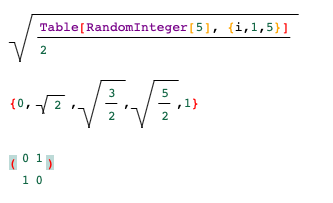

# Advanced Mathematica mode for CodeMirror 6
This is basically a fork of a legacy Mathematica tokenizer 
- [Legacy Modes](https://github.com/codemirror/legacy-modes) (Base)

with added syntax sugar, autocomplete, editable fractions and other 2D input elements based on `Decorations` approach.



This project is still in alpha stage
Feel free to contribute

*works buggy on Safari*
*works great on Firefox/Chrome*

## Key features
- highlighting and autocomplete for `7000` built-in symbols from Mathematica 13
- greek alphabet (use `ESC` + `name`)
- special syntax sugar for fractions, square roots and etc

## Run an demo

```bash
git clone https://github.com/JerryI/codemirror6-mathematica-sugar
cd codemirror6-mathematica-sugar
npm i
npm start
```

## Installation

```
npm i priceless-mathematica
```

Import all extensions as

```js
import { wolframLanguage } from "priceless-mathematica/src/mathematica/mathematica"
import { Arrowholder, Greekholder } from "priceless-mathematica/src/sugar/misc"
import { fractionsWidget } from "priceless-mathematica/src/sugar/fractions";
import { subscriptWidget } from "priceless-mathematica/src/sugar/subscript";
import { supscriptWidget } from "priceless-mathematica/src/sugar/supscript";
import { squareRootWidget } from "priceless-mathematica/src/sugar/squareroot";
import { matrixWidget } from "priceless-mathematica/src/sugar/matrix";
```

and CSS
```css
  span .cm-scroller {
    overflow-y: scroll;
  }
  span .cm-scroller::-webkit-scrollbar {
    width: 4px;
  }
  
  .subscript-tail {
    display: inline-block;
  }
  .fraction {
    display: inline-flex;
  }
  .matrix {
    display: inline-flex;
  }
  .fraction .container .enumenator {
    border-bottom:solid 1px;
  }
      .sqroot {
        display: inline-block;
        vertical-align: middle;
        border-top: 1px solid;
        border-left: 1px solid;
        transform: skew(-15deg);
        transform-origin: bottom left;
        margin: 0 10px;
        position: relative;
      }
      
      .sqroot:before {
        content: "";
        position: absolute;
        bottom: 0;
        height: 40%;
        width: 5px;
        left: -5px;
        border-top: 1px solid;
        border-right: 1px solid;
        transform: skew(30deg);
        transform-origin: bottom right;
      }
      
      .radicand {
        display: inline-block;
        padding-left: 0.5em;
        transform: skew(15deg);
      }
```

or run an example in the root directory by

```bash
git clone https://github.com/JerryI/codemirror6-mathematica-sugar
cd codemirror6-mathematica-sugar
npm i
npm start
```

## Example

Try to paste this code into the CodeMirror 6 editor

```mathematica
CM6Sqrt[CM6Fraction[Table[RandomInteger[5], {i,1,5}], 2]]

{0,CM6Sqrt[2],CM6Sqrt[CM6Fraction[3, 2]],CM6Sqrt[CM6Fraction[5, 2]],1}

(CM6Grid[{{0, 1}, {1, 0}}, RowSpacings -> 1, ColumnSpacings -> 1, RowAlignments -> Baseline, ColumnAlignments -> Center])
```

to postprocess the `Mathematica`'s output you need to define the following symbols

```mathematica
(* unsupported tagbox *)
RowBoxToCM[x_List, y___] := StringJoin @@ (ToString[#] & /@ x)
CMGrid[x_List, y__] := CMGrid[x]
TagBoxToCM[x_, y__] := x

(* on-output convertion *)
$CMReplacements = {RowBox -> RowBoxToCM, SqrtBox -> CM6Sqrt, FractionBox -> CM6Fraction, 
 GridBox -> CM6Grid, TagBox -> TagBoxToCM, SubscriptBox -> CM6Subscript, SuperscriptBox -> CM6Superscript}

(* on-input convertion *)
$CMExpressions = {
        Global`FrontEndExecutable -> Global`FrontEndExecutableWrapper,
        Global`CM6Sqrt -> Sqrt,
        Global`CM6Fraction -> Global`CM6FractionWrapper,
        Global`CM6Grid -> Identity,
        Global`CM6Subscript -> Subscript,
        Global`CM6Superscript -> Superscript}

CM6FractionWrapper[x_,y_] := x/y;
```

then on the desired expression, one can apply

```mathematica
1 + 1;
StringReplace[(% // ToBoxes) /. Global`$CMReplacements // ToString, "\[NoBreak]"->""]
```

and if you want back transformation

```mathematica
(ToExpression[%, InputForm, Hold] /. Global`$CMExpressions // ReleaseHold)
```

## Snippets
- `Ctrl+/` - fractions
- `Ctrl+2` - square root
- `Ctrl+-` - subscript
- `Ctrl+6` - superscript
- `Ctrl+m` - empty matrix


# Acknowledges
- [Marijn Haverbeke](https://github.com/marijnh)
- [Hao](https://github.com/fuermosi777)
